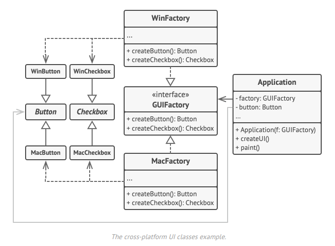
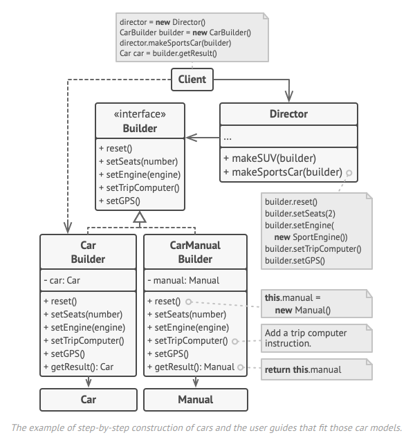
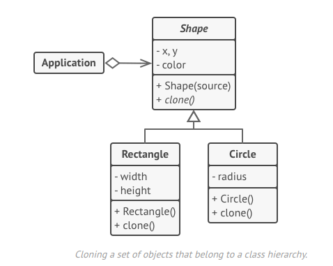
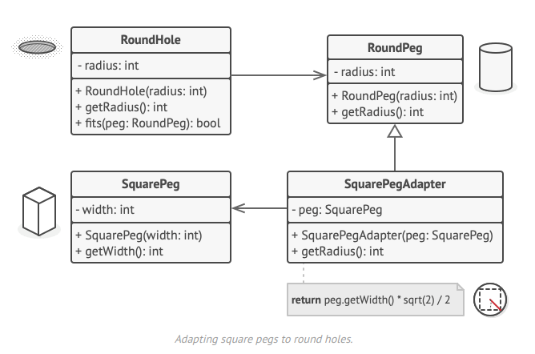
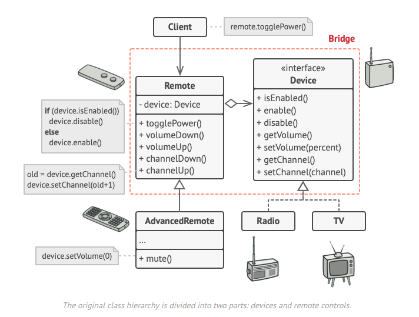
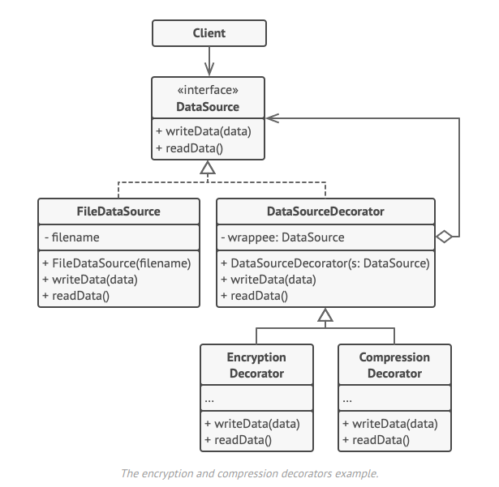
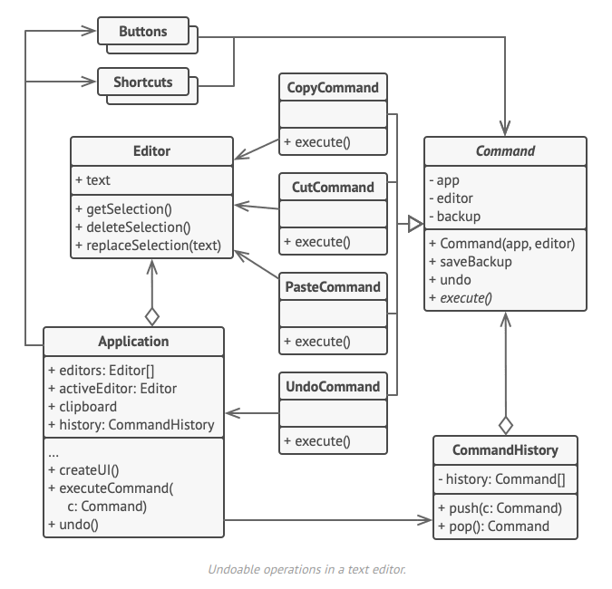

# Design Patterns en C#

## Introduction
En 1995, le **Gang Of Four** (GoF) a introduit dans son livre _"Design Patterns: Elements of Reusable Object-Oriented Software"_ les concepts fondamentaux des **Design Patterns**.

### Qu'est-ce qu'un Design Pattern ?
Un **Design Pattern** est un schéma réutilisable pour résoudre des problèmes complexes de conception dans un environnement orienté objet.

---

### Les trois grandes catégories de Design Patterns

Les **Design Patterns** sont classés en trois catégories principales, selon leur objectif et leur mode d'application :

1. **Patterns de construction**  
    Ces patterns se concentrent sur le processus de création d'objets, en fournissant des solutions pour abstraire ou cacher les détails complexes liés à l'instanciation.
    
    - **Exemples :** Singleton, Factory Method, Abstract Factory, Builder, Prototype.
2. **Patterns structurels**  
    Ces patterns aident à composer des objets ou des classes pour former des structures plus complexes tout en maintenant une flexibilité et une efficacité.
    
    - **Exemples :** Adapter, Bridge, Composite, Decorator, Facade, Flyweight, Proxy.
3. **Patterns comportementaux**  
    Ces patterns définissent comment les objets interagissent et communiquent entre eux, en mettant l'accent sur le comportement dynamique des systèmes.
    
    - **Exemples :** Observer, Strategy, Command, State, Chain of Responsibility, Mediator, Memento, Visitor.

## Exemples de Design Patterns
Voici quelques exemples courants de Design Patterns :

- **Singleton**
- **Repository**
- **Prototype**


### À retenir :
Les **Design Patterns** ne sont pas du code prêt à l'emploi, mais des solutions conceptuelles pour structurer efficacement votre code et résoudre des problèmes récurrents.

---

## Patterns de Construction


### Pattern Abstract Factory
Le **Pattern Abstract Factory** permet de :
- Créer des objets regroupés en familles.
- Découpler la logique de création des objets des classes concrètes, en se basant sur des interfaces communes.

> **Avantage :** Favorise l'extensibilité et la flexibilité en permettant de changer la famille d'objets sans modifier le code.



---

### Pattern Builder

Le **Pattern Builder** est un design pattern de création utilisé pour construire des objets complexes étape par étape. Contrairement à d'autres patterns comme l'**Abstract Factory**, il met l'accent sur le processus de construction plutôt que sur la logique de création des familles d'objets.

Le **Pattern Builder** permet de :
- Simplifie la création d'objets complexes en découpant leur construction en étapes claires et réutilisables.
- Permet de produire différents types et représentations d'un objet complexe avec le même code de construction.

> **Avantage :** Le **Builder** améliore la lisibilité et maintenabilité du code en rendant explicite chaque étape de construction. Il est particulièrement utile lorsque l'objet nécessite une configuration complexe.




---

### Singleton

Le **Pattern Singleton** est un design pattern de création qui vise à garantir qu'une classe n'ait qu'une seule instance tout au long de l'exécution d'un programme, tout en fournissant un point d'accès global à cette instance. Ce pattern est souvent utilisé pour les ressources partagées telles que les connexions à une base de données ou un gestionnaire de configuration.

Le **Pattern Singleton** permet de :

- Assurer qu'une classe ait uniquement une instance, même dans un environnement multi-thread.
- Fournir un moyen d'accéder globalement à cette instance unique sans créer de multiples objets.
- Gérer de manière centralisée des ressources partagées ou des états globaux.

> **Avantage :** Le **Singleton** permet de contrôler l'accès à des ressources critiques, ce qui peut améliorer l'efficacité et réduire les risques de conflits dans un programme. Il est particulièrement utile lorsqu'il faut garantir qu'un objet ou une ressource soit unique tout au long de l'application.

---

### Prototype

Le **Pattern Prototype** est un design pattern de création qui permet de créer de nouveaux objets en clonant des instances existantes au lieu d'instancier des objets directement. Ce pattern est particulièrement utile lorsque la création d'un objet est coûteuse en termes de temps ou de ressources, ou lorsque vous souhaitez éviter de dupliquer des configurations complexes.

Le **Pattern Prototype** permet de :

- Créer de nouveaux objets en copiant des prototypes existants, ce qui peut être plus performant que de créer des objets "from scratch".
- Simplifier la gestion d'objets complexes en réutilisant des configurations préexistantes.
- Permettre de modifier indépendamment les instances copiées sans affecter le prototype original.

> **Avantage :** Le **Prototype** offre une grande flexibilité et réduit la duplication de code lors de la création d'objets complexes. Il est particulièrement utile dans les systèmes où la création d'objets doit être dynamique ou basée sur des configurations spécifiques.



---

## Patterns de Structurel

### Adapter

Le **Pattern Adapter** est un design pattern structurel qui permet de connecter des interfaces incompatibles en convertissant l'interface d'une classe existante en une autre interface attendue par les clients. Ce pattern est particulièrement utile pour intégrer des classes ou des systèmes tiers dans une application sans modifier leur code source.

Le **Pattern Adapter** permet de :

- Faciliter la compatibilité entre des classes avec des interfaces différentes.
- Réutiliser des classes existantes dans un contexte où leur interface n'est pas compatible avec les exigences actuelles.
- Favoriser l'intégration de systèmes ou de bibliothèques externes.

> **Avantage :** Le **Adapter** améliore l'interopérabilité et favorise la réutilisation de code existant sans nécessiter de modifications importantes. Cela permet de réduire le couplage entre les composants d'une application.



---

### Bridge

Le **Pattern Bridge** est un design pattern structurel qui sépare l'abstraction d'une classe de son implémentation, permettant ainsi de les développer indépendamment. Ce pattern est utile lorsque vous avez besoin de découpler des hiérarchies complexes pour améliorer la flexibilité et la maintenabilité.

Le **Pattern Bridge** permet de :

- Découpler une abstraction et son implémentation pour qu'elles puissent évoluer indépendamment.
- Réduire le couplage entre des classes abstraites et leurs implémentations.
- Favoriser l'extension et la réutilisation de code en évitant les combinaisons excessives dans les hiérarchies de classes.

> **Avantage :** Le **Bridge** améliore la modularité et réduit la complexité en permettant de modifier ou étendre les abstractions et les implémentations de manière indépendante.



---

### Decorator

Le **Pattern Decorator** est un design pattern structurel qui permet d'ajouter dynamiquement de nouveaux comportements ou responsabilités à un objet sans modifier son code. Ce pattern favorise la composition d'objets plutôt que l'héritage pour étendre les fonctionnalités.

Le **Pattern Decorator** permet de :

- Étendre les fonctionnalités d'un objet de manière flexible et dynamique.
- Empiler plusieurs décorateurs pour combiner leurs comportements.
- Respecter le principe ouvert/fermé (Open/Closed Principle) en permettant l'extension sans modifier le code existant.

> **Avantage :** Le **Decorator** permet d'ajouter des fonctionnalités à un objet tout en maintenant une structure légère et modulaire, évitant ainsi les combinaisons complexes dans les hiérarchies de classes.



---

## Patterns de Comportementaux


### Command

Le **Pattern Command** est un design pattern comportemental qui transforme une requête ou une action en un objet autonome. Ce pattern permet de paramétrer des objets avec des opérations, de les mettre en file d’attente, ou de les exécuter ultérieurement, tout en favorisant un découplage entre les émetteurs et les récepteurs des requêtes.

Le **Pattern Command** permet de :

- Découpler l'émetteur d'une commande de son exécution.
- Encapsuler des requêtes en tant qu'objets pour les passer comme arguments ou les stocker.
- Implémenter des fonctionnalités comme l'annulation (undo) ou la réexécution (redo).

> **Avantage :** Le **Command** simplifie la gestion des actions complexes et favorise l'extensibilité du système en permettant d'ajouter de nouvelles commandes sans modifier le code existant.



---

### Chain of Responsibility

Le **Pattern Chain of Responsibility** est un design pattern comportemental qui permet de passer une requête à travers une chaîne d'objets potentiellement responsables de son traitement. Chaque objet de la chaîne décide soit de traiter la requête, soit de la transmettre à l'objet suivant dans la chaîne.

Le **Pattern Chain of Responsibility** permet de :

- Découpler l'émetteur d'une requête de ses éventuels gestionnaires.
- Faciliter l'ajout ou la modification des gestionnaires sans changer le code existant.
- Gérer dynamiquement des responsabilités en fonction de la configuration ou du contexte.

> **Avantage :** Le **Chain of Responsibility** offre une solution flexible pour gérer des requêtes complexes tout en réduisant le couplage entre les émetteurs et les gestionnaires.


---

# Utilisation des Design Patterns en C#

## Cas pratiques et solutions

### 1. Créer efficacement de nouveaux contrats en évitant de les recréer à partir de zéro
- **Pattern : Prototype**  
  Ce pattern permet de créer des objets en clonant un prototype existant, ce qui évite la réinstanciation depuis zéro.  
  **Utilisation typique** : Réutiliser des configurations complexes sans duplication de code.

---

### 2. Assurer qu'une classe ait une seule instance (ex. gestionnaire de configuration, connexion à une base de données)
- **Pattern : Singleton**  
  Garantit qu’une classe dispose d’une unique instance tout en fournissant un accès global à celle-ci.  
  **Utilisation typique** : Gestion de ressources partagées ou centralisation d'un état global.

---

### 3. Construire des objets complexes étape par étape, avec une flexibilité pour varier leur représentation finale
- **Pattern : Builder**  
  Permet de construire des objets complexes en suivant des étapes claires et réutilisables.  
  **Utilisation typique** : Création d'objets nécessitant de multiples configurations.

---

### 4. Changer dynamiquement le comportement d’un objet sans modifier son code
- **Pattern : Decorator**  
  Ajoute dynamiquement des responsabilités à un objet existant sans modifier son code source.  
  **Utilisation typique** : Étendre ou combiner des comportements sur mesure sans héritage.

---

### 5. Créer des objets appartenant à des familles sans coupler le code à leurs classes concrètes
- **Pattern : Abstract Factory**  
  Permet de créer des groupes d’objets apparentés en masquant les détails de leur instanciation.  
  **Utilisation typique** : Génération d’interfaces utilisateurs ou composants dépendant de contextes spécifiques.

---

### 6. Créer une interface entre deux systèmes ou classes incompatibles
- **Pattern : Adapter**  
  Transforme une interface existante pour la rendre compatible avec une autre.  
  **Utilisation typique** : Intégrer des bibliothèques tierces sans modification de leur code.

---

### 7. Encapsuler une action ou une requête en tant qu'objet, pour permettre leur paramétrage, mise en file d'attente, ou annulation
- **Pattern : Command**  
  Transforme une action en objet autonome, offrant des fonctionnalités comme l'annulation ou la file d’attente.  
  **Utilisation typique** : Systèmes à commandes multiples (ex. annuler/rétablir dans une application).

---

### 8. Gérer une requête via une chaîne de plusieurs objets potentiellement responsables de son traitement
- **Pattern : Chain of Responsibility**  
  Permet de transmettre une requête à travers une chaîne d’objets jusqu’à ce qu’un d’eux la traite.  
  **Utilisation typique** : Validation de données ou gestion de permissions en cascade.

---

### 9. Découpler une abstraction et son implémentation pour permettre des évolutions indépendantes
- **Pattern : Bridge**  
  Sépare l’abstraction de son implémentation, offrant une plus grande flexibilité.  
  **Utilisation typique** : Systèmes où abstraction et implémentation évoluent séparément.

---

### 10. Composer des objets en structures arborescentes tout en permettant de traiter les objets simples et composites de manière uniforme
- **Pattern : Composite**  
  Permet de structurer des objets sous forme de hiérarchies tout en uniformisant leur traitement.  
  **Utilisation typique** : Représentation d’arbres ou de structures hiérarchiques comme des menus.

---

## Comparaison pour des problématiques similaires

### Ajouter dynamiquement des fonctionnalités à un objet
- **Patterns possibles** :
  - **Decorator** : Ajoute dynamiquement des responsabilités à un objet existant, souvent en empilant des comportements.  
  - **Strategy** : Permet de changer dynamiquement le comportement d’un objet en lui appliquant une implémentation différente.

- **Justification** :
  - **Decorator** est idéal pour empiler des comportements additionnels.  
  - **Strategy** convient mieux pour modifier complètement la logique d'un objet.

---

### Gérer des requêtes dynamiques avec des conditions variées pour leur traitement
- **Patterns possibles** :
  - **Chain of Responsibility** : Transmet une requête à travers plusieurs objets jusqu’à son traitement.  
  - **Command** : Encapsule la requête sous forme d’objet, pour annulation ou mise en file d’attente.

- **Justification** :
  - **Chain of Responsibility** est idéal pour distribuer les responsabilités.  
  - **Command** est utile pour manipuler directement les requêtes.

---

### S'assurer qu’un objet ou une ressource est unique
- **Patterns possibles** :
  - **Singleton** : Assure qu’une seule instance existe dans tout le programme.  
  - **Factory Method** : Peut garantir une unicité via des instances contrôlées.

- **Justification** :
  - **Singleton** est la solution la plus standardisée.  
  - **Factory Method** offre une flexibilité si la gestion d’instances doit évoluer.

---

### Créer des objets sans exposer la logique de leur instanciation
- **Patterns possibles** :
  - **Abstract Factory** : Fournit un moyen de créer des familles d'objets.  
  - **Factory Method** : Génère un seul objet spécifique à la fois.

- **Justification** :
  - **Abstract Factory** convient pour des objets regroupés par famille.  
  - **Factory Method** est plus simple et ciblé pour des objets uniques.

---

### Structurer une application en plusieurs niveaux d'abstraction
- **Patterns possibles** :
  - **Bridge** : Découple abstraction et implémentation pour évoluer indépendamment.  
  - **Adapter** : Simplifie l'intégration de classes ou systèmes existants.

- **Justification** :
  - **Bridge** est idéal pour abstractions et implémentations évolutives.  
  - **Adapter** s'applique mieux pour intégrer des systèmes tiers.

---


## Annexe C#

### Composition
La composition est un mécanisme qui permet à une classe de contenir une instance d'une autre classe ou de cette même classe. Cela permet de structurer les relations entre les objets de manière hiérarchique.

#### Exemple
```csharp
public abstract class ConstructeurLiasseVehicule
{
    protected Liasse liasse; // Exemple de composition
}